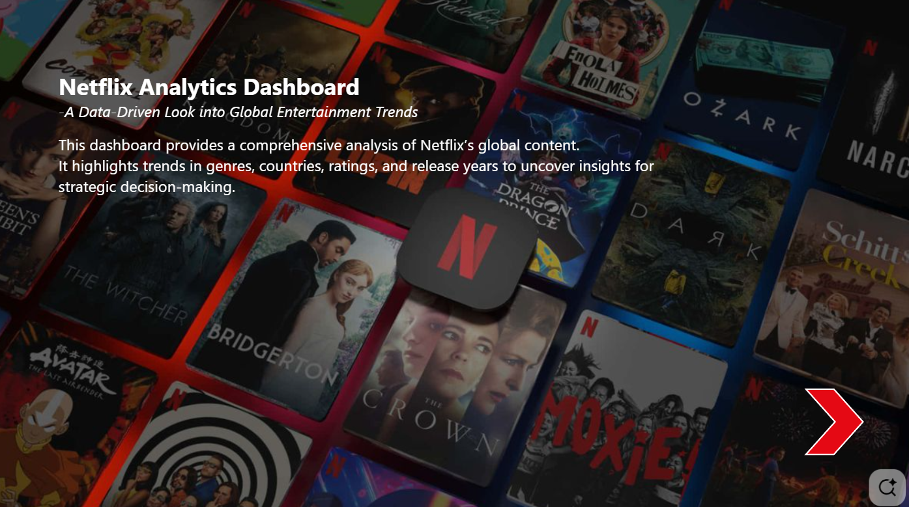
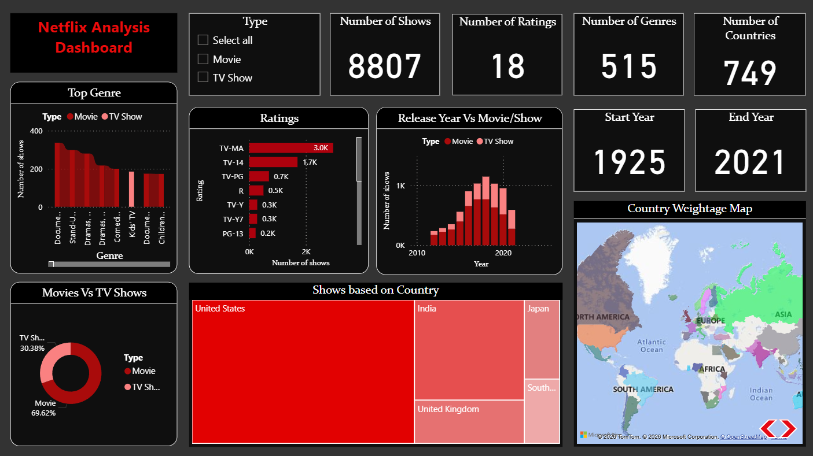
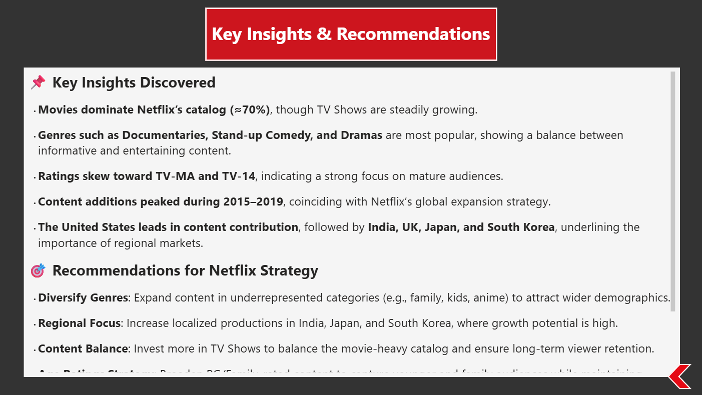

# 🎬 Netflix Content Analytics Dashboard — Power BI

A comprehensive Power BI dashboard analyzing Netflix's global content catalog using the **Netflix Movies & Shows dataset**. This project explores how content distribution, genres, and ratings shape the platform's strategy across regions.

---

## 📽️ Dashboard Demo

▶️ [Click here to watch the dashboard walkthrough](https://www.loom.com/share/60a88ff5a73347b0aee6542965c4867e)

---

## 🖼️ Screenshots

> 📌 *Page 1 background design sourced from Pinterest for visual inspiration*

---

## 🔍 Key Insights

- 🎬 **Movies dominate** the platform at ~70%, but TV Shows are steadily growing their share
- 🎭 **Top genres** — Documentaries, Stand-up Comedy, and Dramas lead the mix, reflecting demand for both knowledge-driven and entertainment-heavy content
- 🔞 **Ratings skew mature** — TV-MA and TV-14 are the most common ratings, highlighting Netflix's focus on adult audiences
- 📈 **Content spike (2015–2019)** — Additions surged during Netflix's global expansion phase
- 🌍 **Top contributing countries** — United States leads, followed by India, UK, Japan, and South Korea, underlining the importance of regional localization

---

## 💡 Key Learnings

- ✔ Structuring large datasets into interactive, decision-focused visuals
- ✔ Communicating insights effectively to make data meaningful
- ✔ Translating raw data into insights that support business strategy in media and entertainment

---

## 🛠️ Tools & Technologies

| Tool | Purpose |
|---|---|
| Power BI Desktop | Dashboard design & data visualization |
| Netflix Movies & Shows Dataset | Source data (Kaggle) |
| DAX | Calculated measures and KPIs |
| Power Query | Data cleaning & transformation |

---

## 🚀 How to View

▶️ [Click here to watch the dashboard walkthrough](https://www.loom.com/share/60a88ff5a73347b0aee6542965c4867e)

Or download the `Netflix Analysis Dashboard.pbix` file from this repo and open with [Power BI Desktop](https://powerbi.microsoft.com/desktop/) (free) to explore interactively.
